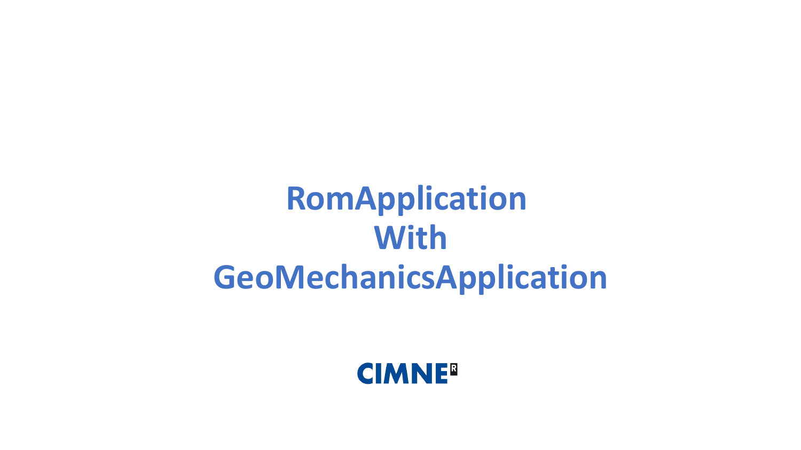
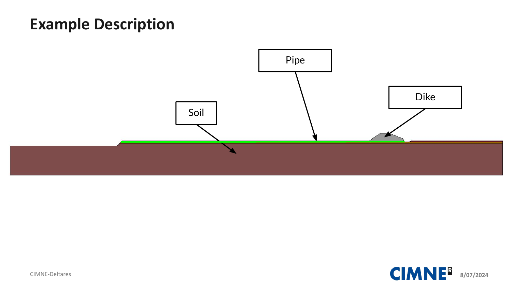
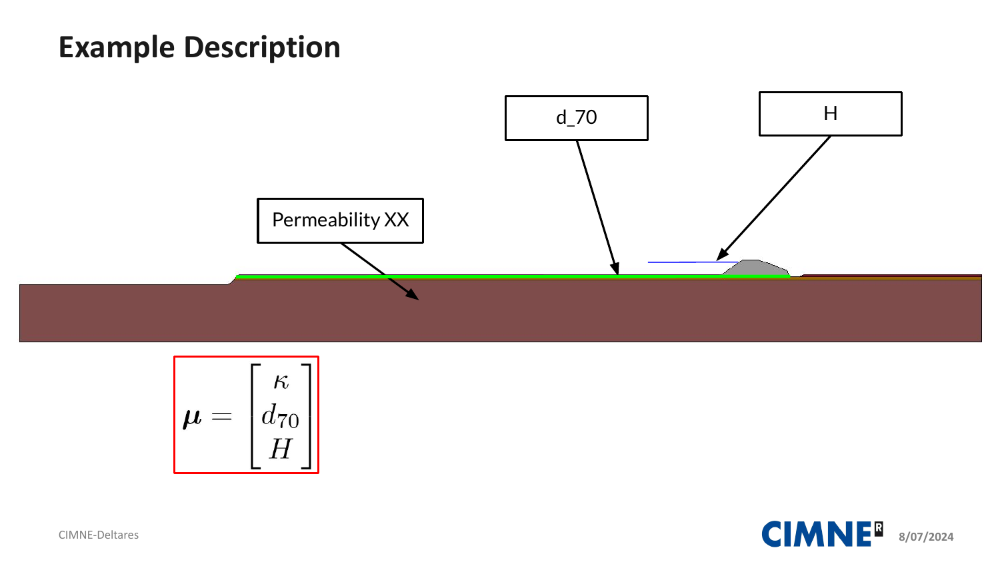
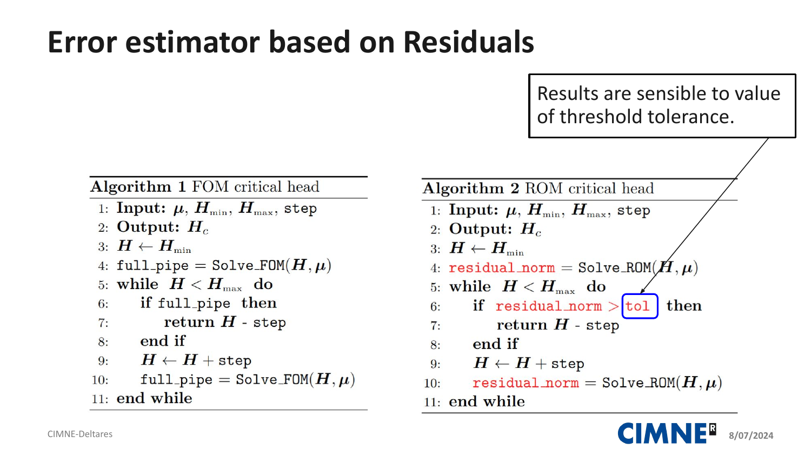

# Piping ROM Implementation (Step 0.1)

This project implements a **Reduced Order Model (ROM)** workflow for steady-state **Backward Erosion Piping** simulations using Kratos Multiphysics. It automates the process of data collection, model reduction (POD), and predictive testing across a parameter space (Permeability and $d_{70}$).



## 🌊 Problem Description: Backward Erosion Piping

Backward erosion piping is a major failure mechanism for hydraulic structures such as dikes and dams. It occurs when water seepage through the foundation soil carries particles away, creating a "pipe" from the downstream exit towards the upstream side.



### Key Parameters ($\mu$)
The simulation explores how the critical head (failure point) changes based on:
*   **Permeability ($\kappa$)**: The Hydraulic conductivity of the soil.
*   **Grain Size ($d_{70}$)**: The characteristic particle size of the soil.
*   **Water Head ($H$)**: The loading parameter increased during the sweep.



## 🧠 Computational Logic: FOM vs ROM

The project compares two execution modes:
1.  **Full Order Model (FOM)**: The standard FEM solution using `GeoMechanicsApplication`. It tracks the pipe development until it traverses the entire geometry.
2.  **Reduced Order Model (ROM)**: A fast surrogate using `RomApplication`. It uses a **Residual Error Indicator** to stop when the approximation can no longer capture the complex non-linear physics of the piping process.




## 🚀 Key Components

### 1. `launch_rom.py`
The main entry point. It orchestrates the entire workflow through a series of "Stages" and defines the custom simulation logic.
- **Error Indicator**: Implements a residual-based check to ensure ROM accuracy.
- **Sampling**: Generates training and test parameter points.
- **Hooks**: Customizes the Kratos simulation to track pipe development and residuals.

### 2. `custom_rom_manager.py`
A specialized ROM manager tailored for the Deltares piping problem.
- **Head Sweep**: Implements a steady-state sweep of water pressure (Head) instead of a simple time-transient.
- **Staged Caching**: Uses a robust hashing system to cache snapshots and results. If you run a case twice with the same parameters, it will load the results from disk instead of re-computing.
- **Storage**: Manages snapshots, POD bases, and QoIs in a structured folder hierarchy.

---

## 🛠 Workflow Stages

The execution is controlled by boolean switches in `launch_rom.py`. You can enable or disable specific parts of the pipeline:

| Stage | Name | Description |
| :--- | :--- | :--- |
| **0** | **Plot Sampling** | Visualizes the distribution of training and test points in the parameter space. |
| **1** | **FOM Training** | Runs full FEM simulations to collect snapshots for the POD basis. |
| **2** | **POD Basis** | Computes the Singular Value Decomposition (SVD) to create the ROM basis. |
| **3** | **Verification** | Tests the ROM on the training set (self-consistency check). |
| **4** | **Test** | Tests the ROM on unseen parameters to measure predictive accuracy. |
| **5** | **Post-Verification** | Generates plots and error metrics for the verification set. |
| **6** | **Post-Test** | Generates plots and error metrics for the unseen test set. |

---

## ⚙️ Configuration Flags

### Execution Controls (`RUN_STAGE_...`)
Set these to `True` or `False` to toggle entire stages of the workflow.

### Caching Controls (`STAGE_..._FORCE_RECOMPUTE`)
- **`False` (Default)**: Reuses existing data found in `rom_data/` if the parameters match.
- **`True`**: Re-runs the simulation/calculation even if existing files are found. Useful after changing code logic or refinement levels.

---

## 📊 Data & Results
- **Snapshots**: Saved as `.npy` files in `rom_data/staged_piping/fom/` and `rom_data/staged_piping/rom/`.
- **POD Basis**: Stored in `rom_data/staged_piping/pod/`.
- **Figures**: Comparison plots are saved in the `figures/` directory.

## 💻 How to Run
Ensure you have Kratos Multiphysics and the `RomApplication` installed, then run:
```bash
python launch_rom.py
```
